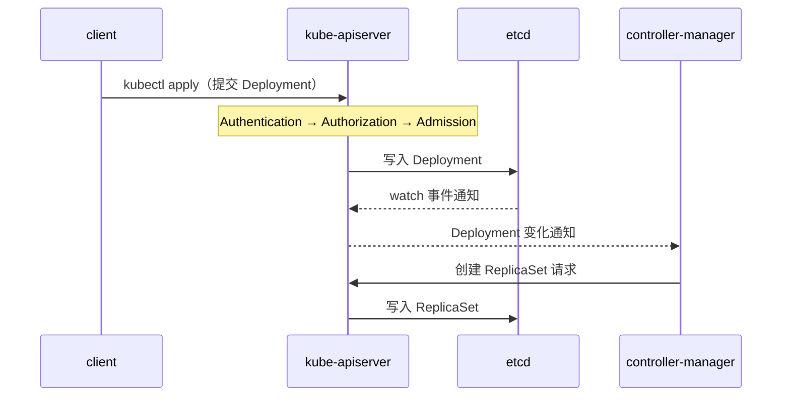

# Deployment 创建时序图

下面展示从客户端提交 Deployment，到 `controller-manager` 创建 ReplicaSet 的核心链路。

```mermaid
sequenceDiagram
  participant C as client
  participant A as kube-apiserver
  participant E as etcd
  participant CM as controller-manager
  C->>A: kubectl apply（提交 Deployment）
  Note over A: Authentication → Authorization → Admission
  A->>E: 写入 Deployment
  E-->>A: watch 事件通知
  A-->>CM: Deployment 变化通知
  CM->>A: 创建 ReplicaSet 请求
  A->>E: 写入 ReplicaSet
```

