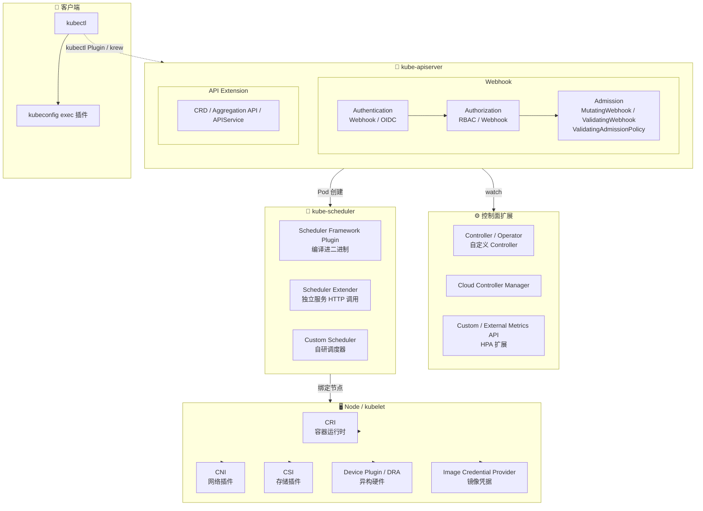

# Kubernetes 扩展体系

Kubernetes 的扩展点分布在客户端、API Server、控制面、调度器以及节点侧。下图展示常见扩展机制与核心组件之间的关系。

```mermaid
flowchart TB
    subgraph L1["👤 客户端"]
        direction LR
        kubectl["kubectl"]
        kubeconfig["kubeconfig exec 插件"]
        kubectl --> kubeconfig
    end

    subgraph L2["🧠 kube-apiserver"]
        direction TB
        subgraph L2a["Webhook"]
            direction LR
            Auth["Authentication<br/>Webhook / OIDC"]
            Authz["Authorization<br/>RBAC / Webhook"]
            Admission["Admission<br/>MutatingWebhook / ValidatingWebhook<br/>ValidatingAdmissionPolicy"]
            Auth --> Authz --> Admission
        end
        subgraph APIExt["API Extension"]
            CRDAgg["CRD / Aggregation API / APIService"]
        end
    end

    subgraph L3["⚙️ 控制面扩展"]
        direction LR
        Ctrl["Controller / Operator<br/>自定义 Controller"]
        CCM["Cloud Controller Manager"]
        Metrics["Custom / External Metrics API<br/>HPA 扩展"]
    end

    subgraph L4["📅 kube-scheduler"]
        direction LR
        Framework["Scheduler Framework Plugin<br/>编译进二进制"]
        Extender["Scheduler Extender<br/>独立服务 HTTP 调用"]
        CustomSched["Custom Scheduler<br/>自研调度器"]
    end

    subgraph L5["🖥️ Node / kubelet"]
        direction LR
        CRI["CRI<br/>容器运行时"]
        CNI["CNI<br/>网络插件"]
        CSI["CSI<br/>存储插件"]
        Device["Device Plugin / DRA<br/>异构硬件"]
        ImageCred["Image Credential Provider<br/>镜像凭据"]
    end

    kubectl -. "kubectl Plugin / krew" .-> L2
    L2 -- "watch" --> L3
    L2 -- "Pod 创建" --> L4
    L4 -- "绑定节点" --> L5
    L5 --> CRI
    L5 --> CNI
    L5 --> CSI
    L5 --> Device
    L5 --> ImageCred
```

