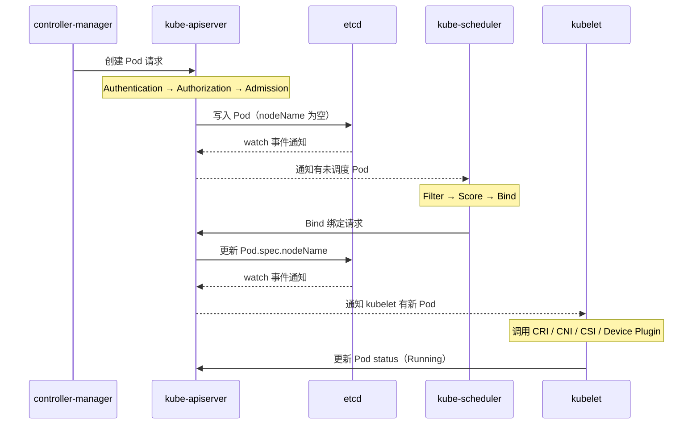

# Pod 创建与调度时序图

下面展示 Pod 从创建、进入待调度状态，到 Scheduler 完成调度，再由 kubelet 启动工作负载的完整链路。

```mermaid
sequenceDiagram
  participant CM as controller-manager
  participant A as kube-apiserver
  participant E as etcd
  participant S as kube-scheduler
  participant K as kubelet
  CM->>A: 创建 Pod 请求
  Note over A: Authentication → Authorization → Admission
  A->>E: 写入 Pod（nodeName 为空）
  E-->>A: watch 事件通知
  A-->>S: 通知有未调度 Pod
  Note over S: Filter → Score → Bind
  S->>A: Bind 绑定请求
  A->>E: 更新 Pod.spec.nodeName
  E-->>A: watch 事件通知
  A-->>K: 通知 kubelet 有新 Pod
  Note over K: 调用 CRI / CNI / CSI / Device Plugin
  K->>A: 更新 Pod status（Running）
```

