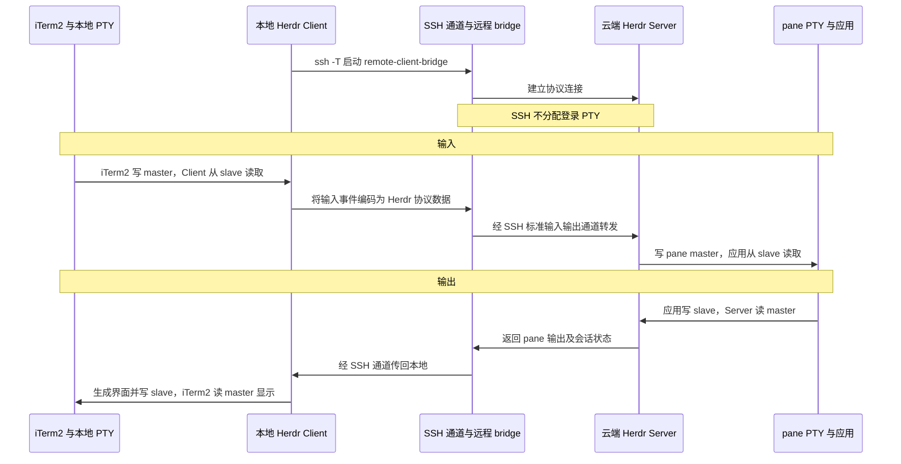
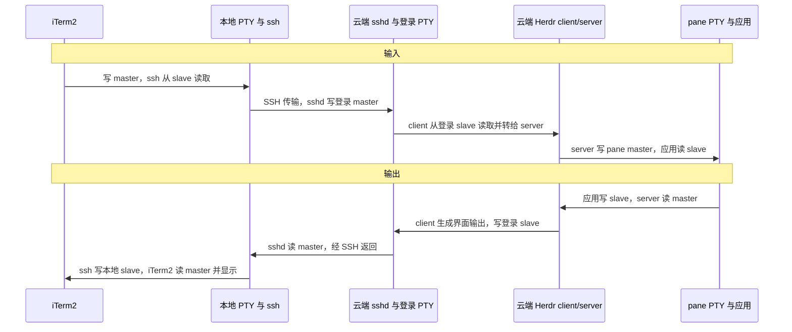

# Herdr 与 PTY 原理

## 1. TTY 与 PTY

历史 TTY 模型中，人操作实体终端，输入经过内核交给应用，输出沿反方向返回。现代 PTY 沿用这个模型，让软件代替实体终端接入主机。

**字符设备：内核以文件接口向用户态暴露设备或驱动能力。** PTY 是内核提供的伪终端，一对 PTY 包含 master 和 slave：

- 写 master → 应用从 slave 读输入。
- 应用写 slave → 从 master 读输出。

TTY 层会按配置处理回显、按行输入和信号，不一定逐字节原样转发。[1]

## 2. 终端模拟器与 PTY 的边界

| 组件 | 职责 |
| --- | --- |
| iTerm2 等终端模拟器（用户态） | 编码按键，解释控制序列，绘制文字、颜色、光标，维护屏幕和滚动历史 |
| PTY / TTY（内核态） | 传递字节，提供终端模式、回显、信号等机制；不绘制画面、不保存永久历史 |

**iTerm2 相当于软件终端，读写 master；应用通常通过连接 slave 的标准输入输出交互。** master 可类比为软件终端接入主机的接口，slave 则是应用使用的 TTY 字符设备。

## 3. Herdr 的远程 PTY 链路

`herdr --remote devbox` 通过 SSH 启动或连接云端 Herdr server。本质上是使用 `ssh -T` 建立 SSH 加密通道，然后将 Herdr client 侧的数据通过该通道直接转到云端 Herdr server。`ssh -T` 中的 `-T` **只是禁止 SSH 给远端命令额外分配 PTY**，并不影响 SSH 加密通道本身的建立和数据传输。[2][4]

| 启动方式 | Herdr client | 主要链路 |
| --- | --- | --- |
| 本地执行 `herdr --remote devbox` | 本地 | 本地 PTY ↔ SSH 桥接 ↔ 云端 Herdr server ↔ pane PTY |
| 先 `ssh devbox`，再执行 `herdr` | 云端 | 本地 PTY ↔ 云端 SSH 登录 PTY ↔ Herdr client/server ↔ pane PTY |

### 方式一：本地 Herdr Client 连接云端 Server

执行 `herdr --remote devbox` 时，本地 Herdr Client 通过 SSH 启动远程 bridge。例如，远程可执行文件位于 `/home/work/.local/bin/herdr` 时，实际启动命令为：

```bash
ssh -T devbox 'exec /home/work/.local/bin/herdr remote-client-bridge'
```

以下泳道图将 SSH 客户端、云端 sshd 和 bridge 合并为一条传输泳道，展示输入与输出的完整路径：



这种方式下，Herdr Client 在本地运行；单个 pane 通常涉及两对 PTY：**本地 PTY 和云端 pane PTY**。SSH 与 bridge 负责传输协议数据，不额外创建 SSH 登录 PTY。

### 方式二：SSH 登录云端后运行 Herdr

第二种方式就是**远程登录云端后，在云端执行 Herdr 命令**。单个 pane 通常涉及三对 PTY：本地 PTY、Herdr client 使用的 SSH 登录 PTY、Herdr server 管理的 pane PTY。

以下泳道图对应第二种方式，client/server 合并为一条泳道：



**每个 pane 的 master 由 Herdr server 持有，slave 连接 shell、Agent 等程序。** 只要 server 和 pane PTY 仍存活，client 断开后任务可以继续，重连时恢复交互。[2][3]

## 4. SSH 何时分配云端 PTY

云端登录 PTY 由 **sshd 按客户端请求分配**，典型默认行为如下：[4]

| 命令 | 云端登录 PTY |
| --- | --- |
| `ssh devbox` | 通常分配，用于交互式 shell |
| `ssh devbox 'bash run.sh'` | 通常不分配，仍能收发 stdin/stdout/stderr |
| `ssh -t devbox 'bash run.sh'` | 显式请求分配 |
| `ssh -T devbox 'bash run.sh'` | 显式禁用分配 |

实际分配受 SSH 配置和服务端策略影响，不改变 iTerm2 已有的本地 PTY。

## 参考

1. [Linux pty(7)](https://man7.org/linux/man-pages/man7/pty.7.html)
2. [Herdr 远程连接](https://herdr.dev/docs/persistence-remote/)
3. [Herdr PTY ownership](https://herdr.dev/blog/live-updates-without-killing-your-terminal-processes/)
4. [OpenSSH ssh(1)](https://man.openbsd.org/ssh)
