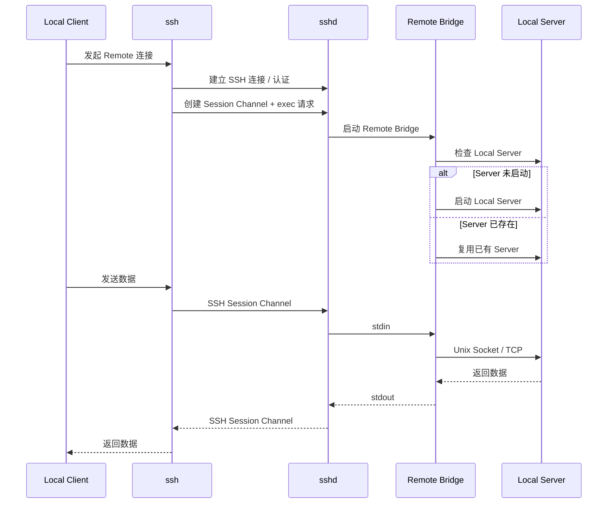

# SSH Bridge 原理说明

## 1. 典型命令

```bash
ssh -T devbox 'exec /home/work/.local/bin/herdr remote-client-bridge'
```

## 2. 核心思想

SSH Bridge 的本质是：

> 使用 SSH Session Channel 作为双向字节流，`sshd` 在远端启动 Bridge 进程，并把客户端数据与 Bridge 的 stdin/stdout 相互转发。

## 3. 整体链路



## 4. sshd 做了什么

SSH 不仅能远程登录，还能**启动远端程序，并通过加密连接双向转发其输入输出**：

1. SSH client 与 `sshd` 建立加密连接，完成认证。
2. 客户端打开 Session Channel，按需申请 PTY，并发送执行命令的请求。
3. `sshd` 启动程序，将 Channel 收到的数据送入程序，将程序输出传回客户端。

**1. 带 PTY：用于交互式程序**

```bash
ssh -t devbox 'vim /tmp/123.txt'
```

`-t` 请求远端 PTY。`sshd` 读写 PTY 主端，Vim 的 `stdin/stdout/stderr` 连接 PTY 从端。

PTY 提供回显、终端尺寸、输入模式和控制字符转信号等终端能力；颜色、光标移动等输出由本地终端模拟器显示。

使用 `-T` 禁止分配 PTY 时，Vim 可能无法正常交互。**原因是缺少终端环境，而非 SSH 无法传输控制字符。**

**2. 不带 PTY：用于服务通信**

```bash
ssh -T devbox 'my-service --stdio'
```

远端服务启动后：

- 本地 SSH 的 `stdin` → Channel → 服务的 `stdin`。
- 服务的 `stdout` → Channel → 本地 SSH 的 `stdout`。
- 服务的 `stderr` 单独传回本地 `stderr`。

不经过远端 PTY，可避免回显、换行转换等干扰，适合协议和二进制数据。服务需要自行支持从 `stdin` 读取请求、向 `stdout` 写入响应。

据此可以实现**本地代理访问云端服务**：本地代理接收请求，通过 SSH 子进程的输入输出与远端通信；远端 Bridge 再通过 Unix Socket 或 TCP 连接实际服务。

`sshd` 负责认证、启动程序和转发字节流；Bridge 负责连接业务服务。SSH 不处理业务消息边界，请求分帧、响应匹配由应用协议实现。
