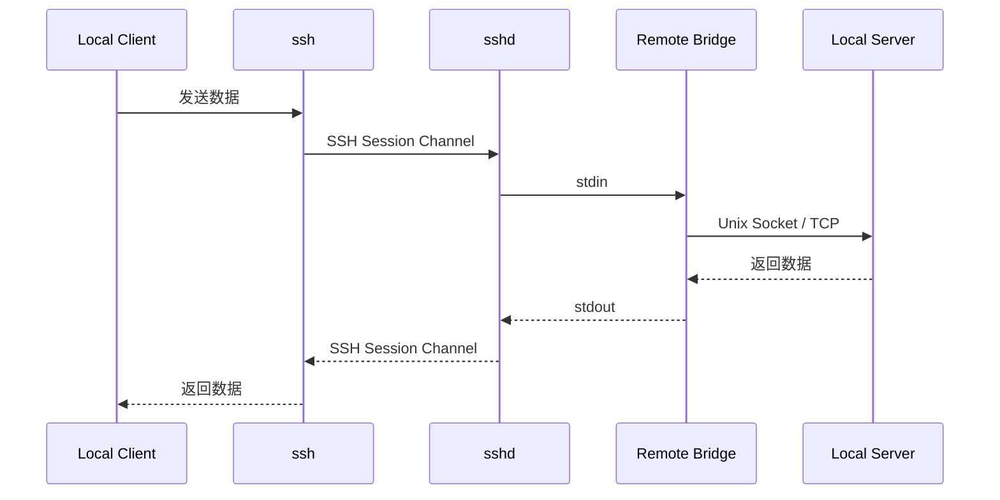

# SSH Bridge 原理说明

## 1. 典型命令

```bash
ssh -T devbox 'exec /home/work/.local/bin/herdr remote-client-bridge'
```

## 2. 核心思想

SSH Bridge 的本质是：

> 使用 SSH Session Channel 作为双向字节流，`sshd` 在远端启动 Bridge 进程，并把客户端数据与 Bridge 的 stdin/stdout 相互转发。

## 3. 整体链路



## 4. sshd 做了什么

`sshd` 主要负责：

1. 建立 SSH 连接并完成认证
2. 创建 Session Channel，并根据 exec 请求启动 Bridge
3. SSH Channel → Bridge stdin
4. Bridge stdout → SSH Channel
