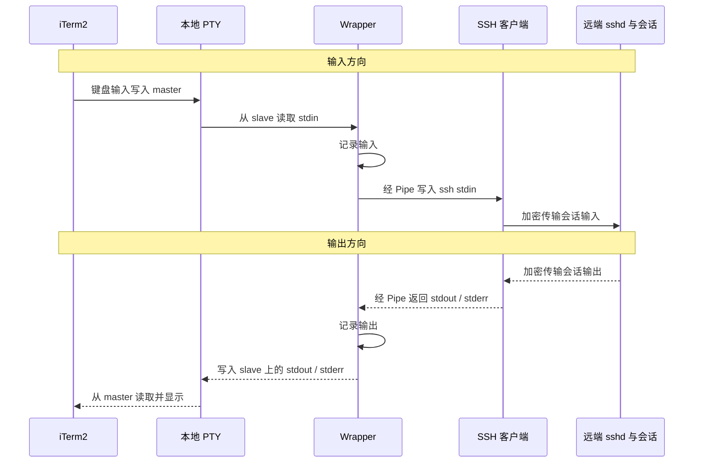

# SSH Wrapper 数据链路

> 本文讨论 **Wrapper 通过 Pipe 转发 SSH 标准输入输出**的方案。Wrapper 复用 iTerm2 已有的本地终端，不额外创建本地 PTY。

## 1. 核心原理

**审计能够成立的关键，是 Wrapper 主动读取、记录并转发数据，而不只是启动 SSH 子进程。**

| 连接位置 | 连接方式 | 作用 |
| --- | --- | --- |
| iTerm2 ↔ Wrapper | 本地 PTY | iTerm2 操作 master；Wrapper 的标准输入输出连接 slave |
| Wrapper ↔ SSH | Pipe | Wrapper 转发并记录 stdin、stdout、stderr |
| SSH ↔ 远端 sshd | SSH 加密连接 | 传输会话数据 |

PTY 是一对内核终端端点，Pipe 是进程间通信通道；它们都不是进程。

## 2. 数据链路泳道图

下面使用 Mermaid 时序图表示各组件之间的输入输出。为保持简洁，将用户操作并入 iTerm2，将远端 shell 和程序归入远端会话。



图中展示的是会话标准输入输出路径；SSH 本地诊断信息也可能经 stderr 进入 Wrapper。

## 3. 进程关系与数据转发

本文假设 Wrapper 直接启动 SSH，因此 **SSH 是 Wrapper 的子进程**。iTerm2 与 Wrapper 之间可能还有启动用的 zsh；如果 Wrapper 先启动 zsh，再由 zsh 启动 SSH，进程关系中也会多一层 shell。

**进程的父子关系不等于数据的转发路径。** Shell 启动子进程后，可以等待其退出，由子进程直接使用继承的文件描述符；数据不一定经过 shell 的读取和转发。

### 直接继承：Wrapper 不代理数据

```go
cmd.Stdin = os.Stdin
cmd.Stdout = os.Stdout
cmd.Stderr = os.Stderr
```

此时 SSH 直接使用对应的终端文件描述符。Wrapper 虽然启动了 SSH，却没有进入字节流的转发路径。Wrapper 同时读取同一终端也不是旁路复制，而可能与 SSH 竞争输入。

### Pipe 转发：Wrapper 进入数据路径

| 方向 | Wrapper 的处理顺序 |
| --- | --- |
| 输入 | 读取 `os.Stdin` → 记录输入 → 写入 SSH 的 stdin Pipe |
| 标准输出 | 读取 SSH 的 stdout Pipe → 记录输出 → 写入 `os.Stdout` |
| 标准错误 | 读取 SSH 的 stderr Pipe → 记录错误输出 → 写入 `os.Stderr` |

实现时需要并发处理三个方向，避免某一路 Pipe 写满后阻塞；同时处理 EOF、关闭管道、子进程退出和退出码传递。

## 4. PTY 与交互行为的边界

**本方案没有新增本地 PTY，不代表远端也没有 PTY，也不代表仅靠 Pipe 就能完整复现交互终端。**

| 问题 | 说明 |
| --- | --- |
| SSH 还能把 stdin 识别为终端吗？ | stdin 接到 Pipe 后，SSH 看到的是管道，不能依赖原来的终端检测行为 |
| 远端需要 PTY 怎么办？ | 可用 `ssh -tt user@host` 强制请求远端 PTY；`-T` 禁用远端 PTY。服务端仍可拒绝请求 [1] |
| `-tt` 会创建本地 PTY 吗？ | 不会，它控制远端 PTY 的请求，也不会自动补齐本地交互行为 |
| 逐键输入和 Ctrl+C 如何处理？ | Wrapper 需要明确管理本地终端模式；否则行缓冲、回显和本地信号处理可能改变输入行为 |
| 窗口大小能自动同步吗？ | Pipe 不携带终端尺寸。需要另行设计尺寸同步，不能只依赖字节转发 |
| 密码提示一定经过 stdin/stdout 吗？ | 不一定。SSH 可能直接访问控制终端（如 `/dev/tty`），或使用 askpass，绕过标准输入输出代理 [1] |

若要透明支持完整交互式终端，可以考虑由 Wrapper 为 SSH 额外分配本地 PTY；这是另一种架构，不能与本文的 Pipe 方案混为一谈。

## 5. 审计能记录什么

- **能够记录：**实际经过 Wrapper 转发的输入输出字节，以及方向、时间等元信息。
- **不能直接等同于：**用户最终执行的命令。输入中可能包含退格、方向键、补全及终端控制序列。
- **不能覆盖：**绕过标准输入输出的控制终端访问，以及 SSH 端口转发等其他通道的数据。
- **加密边界：**Wrapper 记录的是 SSH 加密前的输入和解密后的输出；SSH 客户端与远端 sshd 之间仍然加密通信。

## 6. Mermaid 显示说明

图表代码块必须使用 `mermaid` 语言标记，即以三个反引号后接 `mermaid` 开始，以三个反引号结束。只有普通代码围栏时，通常会显示源码。

同时，Markdown 阅读器需要支持 Mermaid 渲染；不要再把整篇笔记包进外层代码块。

## 参考资料

1. [OpenSSH：ssh(1) — PTY 分配、交互会话与密码提示](https://man.openbsd.org/ssh.1)
